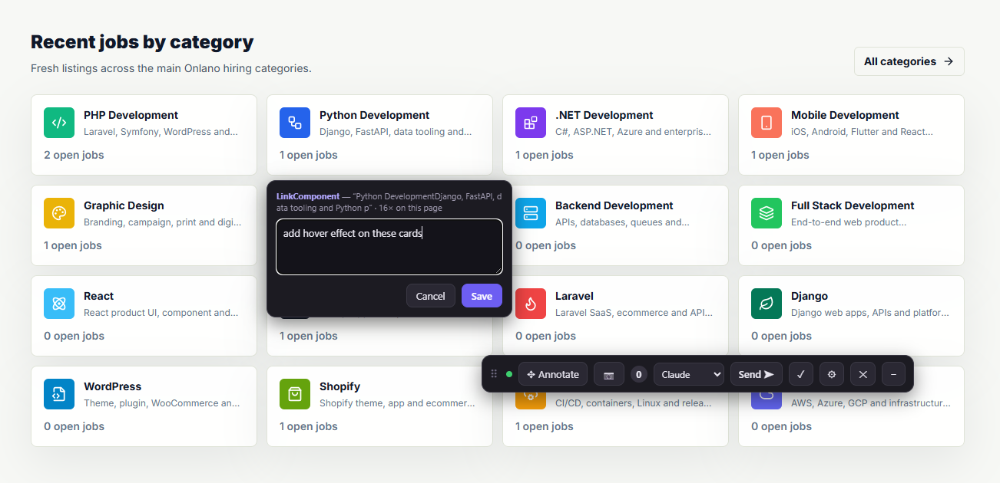
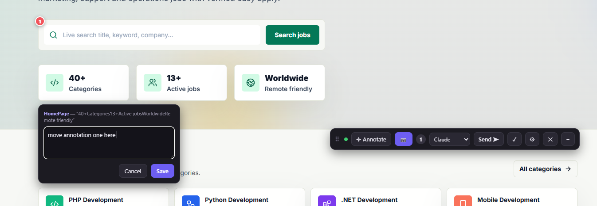
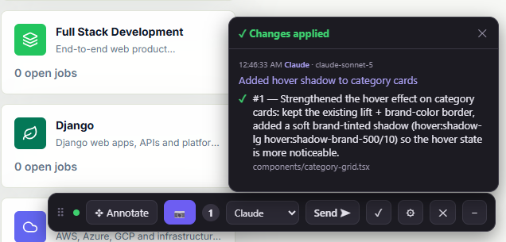

# Claude Annotator

Install with `cd claude-annotator && node install.mjs`, then run `/annotate` in your project: click elements in the browser, describe what should change, and your AI agent (Claude Code, OpenCode, Codex, Antigravity) edits the exact component file, not the whole codebase.

## Why this is useful

Normally, describing a UI tweak to an agent means it has to go hunting: grep for text, guess the component, read half the codebase, maybe edit the wrong file because three components render similar-looking cards. That's slow and expensive in tokens.

Claude Annotator skips all of that. A small Chrome extension runs on your `localhost` dev server. You click **Annotate**, click any element on the page, and type your request:



For every element you click, the extension captures:

- your change request (the prompt you typed)
- the page URL
- a CSS selector plus a snippet of the element's HTML/text
- the **React component chain** (walked via `_debugOwner`, works for both client fiber components and React Server Components)
- **creation site stack frames**, resolved through sourcemaps back to your original source, even through Turbopack/webpack dev builds, producing an exact target like `src/components/site/search-box.tsx:66`

You can drop as many annotations as you want on one page, on multiple elements, and move a pin if you clicked the wrong spot:



Then pick your target agent from the toolbar dropdown and hit **Send**. This isn't Claude only. The same toolbar can route a batch to Claude, Codex, OpenCode, Antigravity, or any agent you've installed the tool for, each with its own queue, so more than one agent can work off different batches without stepping on each other.

The agent reads the batch, jumps straight to the referenced file and line with no exploration, implements the change, and reports back into the page itself:



The "Changes applied" panel shows exactly what changed, which files were touched, and which agent and model did it, so you never have to tab back to a terminal to know if it worked. The dev server hot reloads the visual result automatically.

## Not just a Next.js thing

Built with Next.js in mind first (it resolves React Server Component chains and Turbopack/webpack sourcemaps out of the box), but it works with any React app: Vite, CRA, Remix. The component chain and sourcemap resolution only depend on React's own dev mode debug info (`_debugOwner`, `_debugSource`, `_debugStack`), not on Next.js internals. Next.js is just where the token savings matter most, since big app-router pages often inline many sections in one file, and an exact `file:line` target helps even more there. Point it at a Vite or CRA app and you get the same exact-file targeting; point it at a non-React page and you still get selector and HTML snippet targeting, which covers most CSS and copy tweaks.

## How it works, in two parts

1. **`extension/`**: a Chrome (MV3) extension that runs on `localhost` pages. Adds a small draggable toolbar with an element picker, an agent dropdown, a "Changes applied" history panel, and a settings panel for per-agent instructions.
2. **`launch.mjs`**: a Node script used by the `/annotate` agent skill. It starts a tiny HTTP bridge on `localhost:4747`, launches Playwright's Chromium with the extension loaded, and opens your dev server. Each batch you send is written to `.claude-annotations/<agent>/inbox/<timestamp>.json` (plus `latest.json`), one queue per agent, and the session keeps running: annotate and send as many batches as you like; closing the browser ends it.

Around them, small helpers close the loop with whichever agent you send to:

- **`agent.mjs --agent <id>`**: one-command loop. Reuses or launches the browser, waits for the next batch addressed to `<id>`, prints the batch plus a literal implement, report, re-run checklist.
- **`agents.mjs` / `agents.json`**: the registry of agents that have installed this tool. Each entry can carry a per-agent modifier prompt (standing instructions) attached to every batch sent to it.
- **`wait.mjs --agent <id>`**: blocks until the next batch for `<id>` arrives.
- **`report.mjs --agent <id> --model <model-id>`**: posts a JSON summary of what was changed back to the bridge, rendered as the "Changes applied" panel, attributed to the agent and its exact model.
- **`browse.mjs`**: lets the agent drive the browser itself, cropping a screenshot of any annotation's element, navigating, or reloading, without the user doing anything.
- **`bridge.mjs`**: the shared HTTP bridge used by `launch.mjs` and `server.mjs`.

## Install (one command)

```sh
cd claude-annotator
node install.mjs            # installs deps + the /annotate skill for all projects (registers as "claude")
node install.mjs --project  # ...or into the current project's .claude/skills only
node install.mjs --agent opencode   # another agent: registers it AND installs its /annotate command
```

Non-Claude agents get the generic one-command skill (`skill/AGENT_SKILL.md`) written into their native location: OpenCode gets `~/.config/opencode/command/annotate.md` (or `.opencode/command/` with `--project`), Codex gets `~/.codex/prompts/annotate.md`, anything else gets `agents/<id>-annotate.md` in this folder.

The installer bakes this folder's current location into the skill, so you can move or copy the directory anywhere (or to another machine) and just re-run it. Add `--no-deps` to skip the npm / Playwright Chromium checks.

> **For Claude / AI agents:** to install this tool, run `node install.mjs` in this directory, then tell the user to restart Claude Code so the `/annotate` skill registers. Do not hand-copy `skill/SKILL.md`, it is a template with `{{ANNOTATOR_DIR}}` placeholders that the installer renders.
>
> **If you are a different coding agent** (OpenCode, Codex, Antigravity, or anything else) being pointed at this folder and asked to install it, read **[`AGENTS.md`](./AGENTS.md)** in this directory. It's a self-contained, agent-agnostic install and wait/implement/report loop written for exactly this situation.

> Branded Google Chrome 137+ ignores `--load-extension`, which is why the launcher uses Playwright's Chromium build.

## Build / package the extension

```sh
npm run build                    # validate + package
node build.mjs --bump patch      # bump 1.0.0 -> 1.0.1 in manifest + package.json
```

The build validates the manifest, syntax-checks every referenced script, and emits:

- `dist/unpacked/` for `chrome://extensions` → "Load unpacked"
- `dist/claude-annotator-extension-v<version>.zip`, ready for the Chrome Web Store or sharing (a `.crx` is not produced; the Web Store repacks zips)

## Use with Claude Code

Run `/annotate` inside any project. Claude will:

1. Detect (or start) your dev server.
2. Run `launch.mjs` in the background and tell you the browser is ready.
3. Wait while you annotate: click **Annotate**, click an element, type what should change, repeat for as many elements as you want, then pick **Claude** in the toolbar's agent dropdown (the default) and click **Send**.
4. Read the resulting JSON, jump straight to the referenced component files, and implement each change.
5. Report what it changed back into the page. The "Changes applied" panel lists each annotation's outcome (the checkmark toolbar button reopens it).
6. Keep waiting: the browser stays open and every new batch addressed to Claude is processed automatically until you close it.

If other agents have registered themselves (see the install section above), the same dropdown lets you route a batch to them instead, each with its own queue, so switching targets never steals a batch meant for someone else.

## Use in your everyday Chrome (optional)

Load `extension/` (or `dist/unpacked/`) via `chrome://extensions` → Developer mode → "Load unpacked", then start the standalone listener so **Send** has somewhere to go:

```sh
npm run serve                 # persistent: collects every batch
node server.mjs --once        # exit after the first batch (legacy single-shot)
```

Each batch is sourcemap-resolved and written to `.claude-annotations/<agent>/latest.json` plus `<agent>/inbox/<timestamp>.json` (run it from your project directory, or pass `--out-dir`); `<agent>` is whichever target you picked in the dropdown. The persistent server supports the same `wait.mjs`/`report.mjs` loop as the launcher, so the target agent picks batches up automatically; otherwise ask it to "check my annotations." Without any listener running, **Send** falls back to copying the JSON payload to your clipboard so you can paste it into your agent manually.

## Notes

- Component names and source paths are only available on dev builds (production React strips debug info and minifies names).
- The annotation popup shows a friendly target (component name and text snippet); the technical details (selector, HTML, file:line) still travel in the payload for the target agent, they are just not displayed.
- The green dot in the toolbar means the bridge is reachable.
- Drag the toolbar by the grip icon on its left to move it anywhere; the position is remembered per port.
- Paste an image into a note (`Ctrl+V`) to attach a reference image (a mockup or external screenshot) to that annotation, always sent, arriving as `imagePath` with `imageKind: "reference"`. The camera toggle is separate: it adds a full-page screenshot of the app (`screenshotPath`) to each send.
- Agents can drive the browser themselves via `browse.mjs` (see above): crop an exact area, navigate, or reload, without the user doing anything.
- The agent dropdown is populated from `agents.json` (via the bridge's `/agents` endpoint) and remembers your last pick per port in localStorage.
- The settings button opens per-agent instructions: a saved modifier prompt per agent, attached to every batch sent to it (as `agentPrompt`). Stored in `agents.json` via the bridge (with a localStorage fallback), so it applies across projects.
- The checkmark button shows recently applied changes; each batch is attributed to the agent that made it and the exact model it reported via `report.mjs --model`, and history survives bridge restarts.
- `Esc` exits picker mode; `Ctrl+Enter` saves the annotation form.
- Launcher flags: `--url`, `--dir`, `--out` (legacy), `--port`, `--headless`, `--once`. If a session is already live for the project it prints `ALREADY_RUNNING=1` and reuses it instead of opening a second browser.
- `wait.mjs`/`report.mjs` both take `--agent <id>` (default `claude`) to scope them to one agent's queue; `report.mjs --model <id>` attributes the report to the agent's exact model; `wait.mjs --timeout <sec>` exits 4 instead of blocking forever (for agents without background shells).
